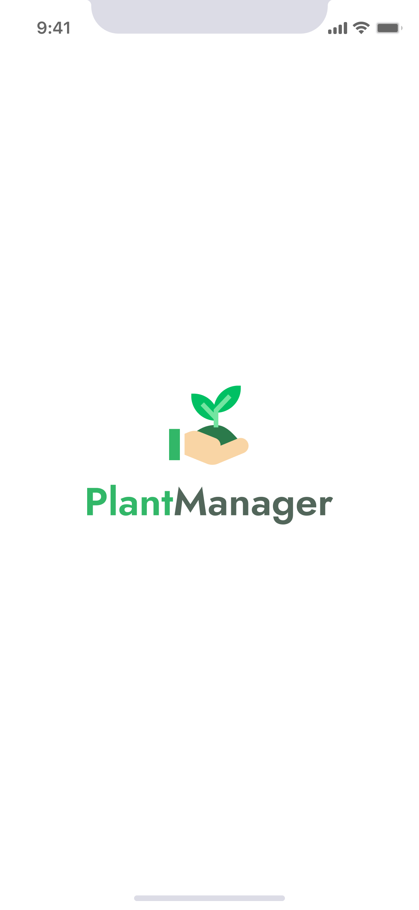
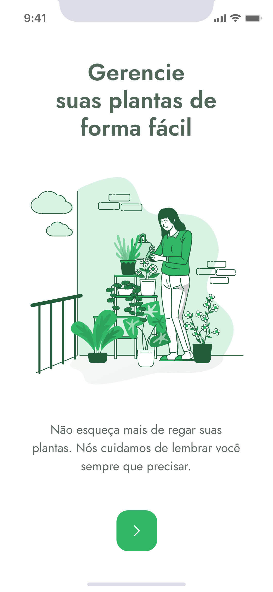
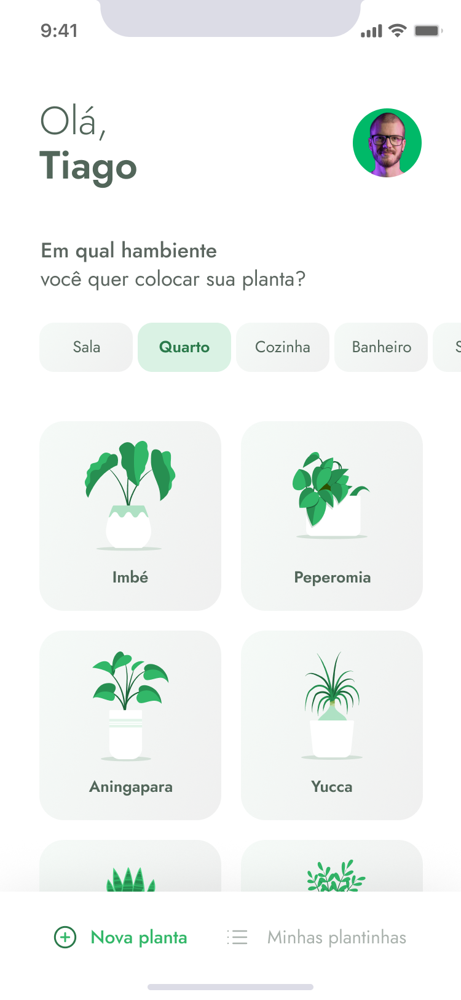
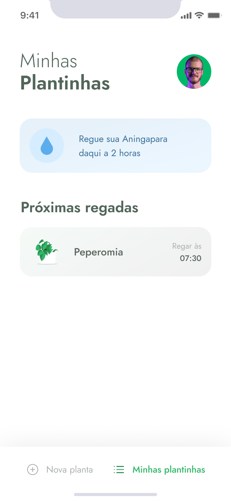
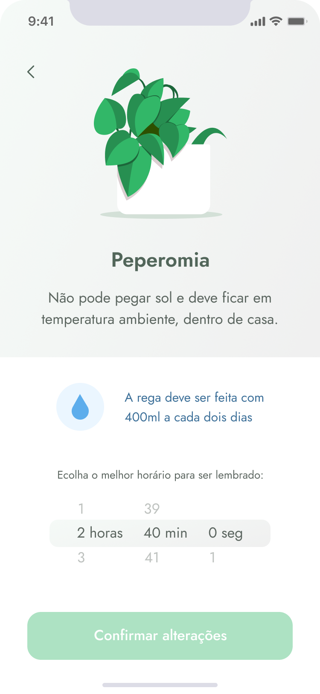

## [Read this page in English](https://github.com/ojeffpinheiro01/podcastr)

<h1 align="center">
   
</h1>  


## Menu

[Sobre o projeto](#book-sobre-o-projeto)

[Tecnologias](#rocket-tecnologias)

[Preview](#eyes-preview)

[Layout](#art-layout)

[Rodando no seu smartphone](#iphone-rodando-no-seu-smartphone)

[Como contribuir](#gear-como-contribuir)

[Contato](#mailbox-contato)

[Siga-me ](#siga-me)

<br>
 
---

# :book: Sobre o projeto 
O PlantManager é uma aplicação para lembra-lo de regar suas plantas conforme a necessidade da espécie
Está sendo desenvolvido durante o Next Level Week # 5 - Trilha React Native - oferecido pela Rocketseat
 <h4 align="center">:construction: Em desenvolvimento da versão 2.0 :construction:</h4>
 
---

# :rocket: Tecnologias
Este projeto foi desenvolvido com as seguintes tecnologias:
- [Expo](https://expo.io)
- [React Native](https://reactnative.dev)
- [Typescript](typescriptlang.org/)

---

# :eyes: Preview
## Mobile Screenshot
<div>
   
   <br>
   
   <br>
   
   
   
   
   
   
</div>

---

# :art: Layout
O Layout foi desenvolvido pelo [Tiago Luchtenberg](https://www.instagram.com/tiagoluchtenberg/), e você pode acessá-lo no [Figma](https://www.figma.com/file/mi2Jvyn39ch96bxMyhqcOJ/PlantManager-(Copy)?node-id=0:1)

---

# :iphone: Rodando no seu smartphone
## Condição prévia 
- Você precisa já ter instalado o Aplicativo do Expo no seu smartfone
<h3 align="center">
  <a href="https://apps.apple.com/app/apple-store/id982107779">
    
  </a>
  <a href="https://play.google.com/store/apps/details?id=host.exp.exponent&referrer=www">
    
  </a>
 </h3>
 
 
 - Abra o Expo 
 - Clique para scanear o QR Code 
 - Aponte o celular para o QR Code abaixo:
 <h3 align="center">
  
</h3>
---

# :gear: Como contribuir
```bash
- Faça um fork desse repositório;
- Crie uma branch com a sua feature: git checkout -b minha-feature;
- Faça commit das suas alterações: git commit -m 'feat: Minha nova feature';
- Faça push para a sua branch: git push origin minha-feature;
```

---

# :mailbox: Contato	
[](https://www.linkedin.com/in/jeferson-pinheiro/)
[](mailto:jefersonpinheirodesouza@gmail.com)

---

# Siga-me 
<p align="center">
<a href="https://dev.to/ojeffoinheiro" target="blank"></a>
<a href="https://codepen.io/ojeffoinheiro" target="blank"></a>
<a href="https://linkedin.com/in/jeferson-pinheiro" target="blank"></a>
<a href="https://stackoverflow.com/ojeffpinheiro" target="blank"></a>
<a href="https://codesandbox.io/u/ojeffoinheiro" target="blank"></a>
<a href="https://app.rocketseat.com.br/me/jeferson-pinheiro-de-souza-1580117763" target="blank"></a>
</p>

---

>Este projeto foi desenvolvido com ❤️ por **[Jéferson Pinheiro](https://www.linkedin.com/in/jeferson-pinheiro/)**, com o instrutor **[Rodrigo Santana](https://www.linkedin.com/in/rodrigomir/)** durante a **[Next Level Week # 5 - Trilha React Native](https://nextlevelweek.com/episodios/reactnative/1/edicao/5)** da **[Rocketseat](https://rocketseat.com.br)** 💜<br> 
Se te ajudou, dá ⭐, vai me ajudar também 😉