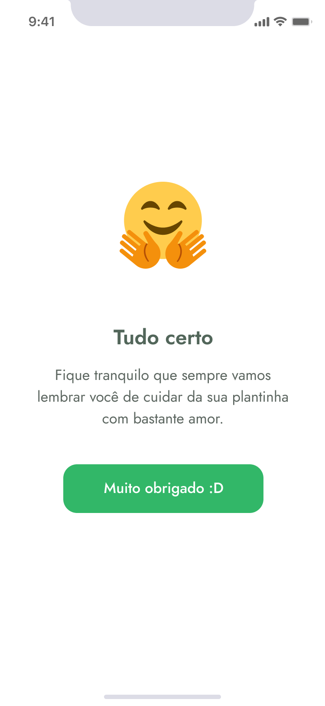

## [Leia esta página em português](https://github.com/ojeffpinheiro01/plantmanager/blob/main/README-PT.md)

<h1 align="center">
   
</h1>


## Menu

[Overview](#book-overview)

[Technology](#rocket-technology)

[Preview](#eyes-preview)

[Layout](#art-layout)

[Running on your smartphone](#iphone-running-on-your-smartphone) 

[How to contribute](#gear-how-to-contribute)

[Reach me](#mailbox-reach-me)

[Connect with me](#connect-with-me)

<br>

# :book: Overview
PlantManager is an application to remind you to water your plants according to the needs of the species
It is being developed during the Next Level Week #5 - ReactJs Trail - offered by Rocketseat
<h4 align="center"> :construction: In development :construction:</h4>
 
---

# :rocket: Technology
This project was developed with the following technologies:
- [Expo](https://expo.io)
- [React Native](https://reactnative.dev)
- [Typescript](typescriptlang.org/)

---

# :eyes: Preview
## Mobile Screenshot
<div>
   
   <br>
   
   <br>
   
   
   
   
   
   
</div>

---

# :art: Layout
The Layout was developed by [Tiago Luchtenberg](https://www.instagram.com/tiagoluchtenberg/), and you can access it on [Figma](https://www.figma.com/file/mi2Jvyn39ch96bxMyhqcOJ/PlantManager-(Copy)?node-id=0:1)

---

# :iphone: Running on your smartphone
## Precondition 
- You must already have the Expo App installed on your smartphone
<h3 align="center">
  <a href="https://apps.apple.com/app/apple-store/id982107779">
    
  </a>
  <a href="https://play.google.com/store/apps/details?id=host.exp.exponent&referrer=www">
    
  </a>
 </h3>
 
 
  - Open the Expo
  - Click to scan the QR Code
  - Point your phone to the QR Code below:
  <h3 align = "center">
   
</h3>


# :gear: How to contribute 
```bash
- Fork this repository;
- Create a branch with your feature: `git checkout -b my-feature`;
- Commit your changes: `git commit -m 'feat: My new feature'`;
- Push to your branch: `git push origin my-feature`.
```
---

# :mailbox: Reach me	
[](https://www.linkedin.com/in/jeferson-pinheiro/)
[](mailto:jefersonpinheirodesouza@gmail.com)

---

# Connect with me
<p align="center">
<a href="https://dev.to/ojeffoinheiro" target="blank"></a>
<a href="https://codepen.io/ojeffoinheiro" target="blank"></a>
<a href="https://linkedin.com/in/jeferson-pinheiro" target="blank"></a>
<a href="https://stackoverflow.com/ojeffpinheiro" target="blank"></a>
<a href="https://codesandbox.io/u/ojeffoinheiro" target="blank"></a>
<a href="https://app.rocketseat.com.br/me/jeferson-pinheiro-de-souza-1580117763" target="blank"></a>
</p>

---

>This project was developed with ❤️ by **[Jéferson Pinheiro](https://www.linkedin.com/in/jeferson-pinheiro/)**,  with the instructor **[Rodrigo Santana](https://www.linkedin.com/in/rodrigomir/)** during the **[Next Level Week #5 - Trilha React Native](https://nextlevelweek.com/episodios/reactnative/1/edicao/5)** of **[Rocketseat](https://rocketseat.com.br)** 💜<br> 
If it helped you, give it ⭐, it will help me too 😉
